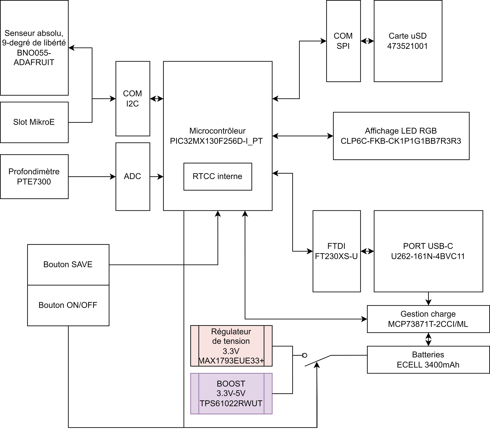

# 2221_UnderwaterLocalization
> Project for the localization of an underwater module.
> Demonstration [here](https://www.example.com). <!-- If you have the project hosted somewhere, include the link here. -->

## Table of Contents
* [General Information](#general-information)
* [Technologies Used](#technologies-used)
* [Features](#features)
* [Configuration](#configuration)
* [Usage](#usage)
* [Project Status](#project-status)
* [Improvements](#improvements)
* [Contact](#contact)
<!-- * [License](#license) -->

## General Information
This project revolves around an onboard electronic card designed to store measurement data about the movement of an underwater module through an inertial unit and a pressure sensor. This aims to mathematically locate it from its starting point (reference). This is crucial because underwater localization isn't an easy task, especially given the various underwater communication constraints, notably that electromagnetic waves do not propagate easily there.
<!-- You don't have to answer all the questions - just the ones relevant to your project. -->

## Technologies Used
- MPLAB Harmony v2_06
- Microcontroller - PIC32MX130F256D
- Inertial Unit - Bosch BNO055

## Features
- Saving a data set every 100ms.
- Maximum usage depth of 60m.
- 2 hours of logging onto an SD card.
- Sensing on 9 axes:
  - 3-axis accelerometer.
  - 3-axis gyroscope.
  - 3-axis magnetometer.
  - Temperature sensor
  - Depth gauge [0->10bar] [Res 1/10]
  - 3 to 5 free MikroE slots for additional measurements.
- Capability to save location of points of interest via:
  Saving button [To be defined: Magnetic, Optical, Mechanical or other].
- Battery with a minimum autonomy of 2 hours.
- Battery charging via USB connector.
- Data reading through USB connector (Electronic interfacing, software
  optional in this version).
- LED Interface.

    

## Configuration
The electronic card must be assembled considering the manufacturing files and the BOM (Bill of Materials). The firmware then needs to be implemented into the PIC microcontroller, and an SD card should be inserted to read the movement data.

## Usage
The firmware code needs to be flashed using MPLAB-X with harmony onto the microcontroller of the produced PCB. To do this, there's a BERG programming connector. Once the code is flashed, the underwater module can be used, and provided an SD card is inserted, movement data will be saved in CSV format.

## Project Status
The project is completed, but improvements can always be made.

## Improvements
To do:
- [DONE] SCK VALID ONLY AT PIN 14 instead of 20
- [DONE] CHANGE U2TX PIN (PIN14) TO ANOTHER PIN
- [DONE] EXTERNAL OSCILLATOR MUST BE CONNECTED AS SECONDARY OSCILLATOR AND NOT PRIMARY
- Review multiplexer system (choice of CS polarity).

## Contact
Created by Ali Zoubir: ali.zoubir@etml-es.ch
